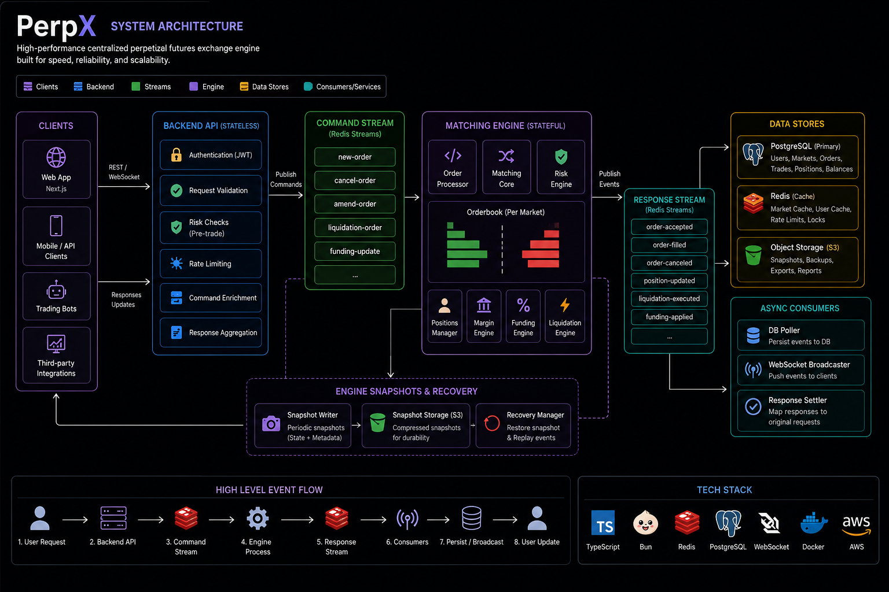
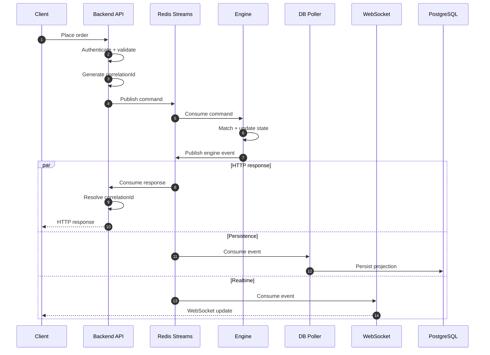
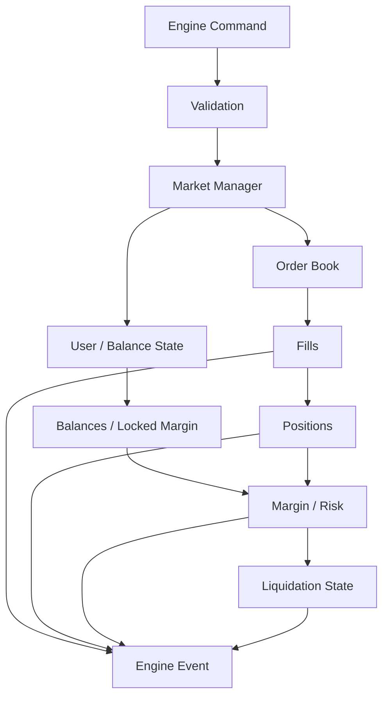
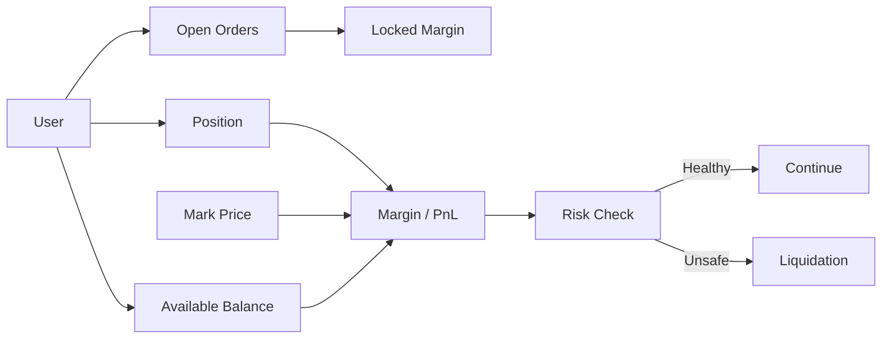
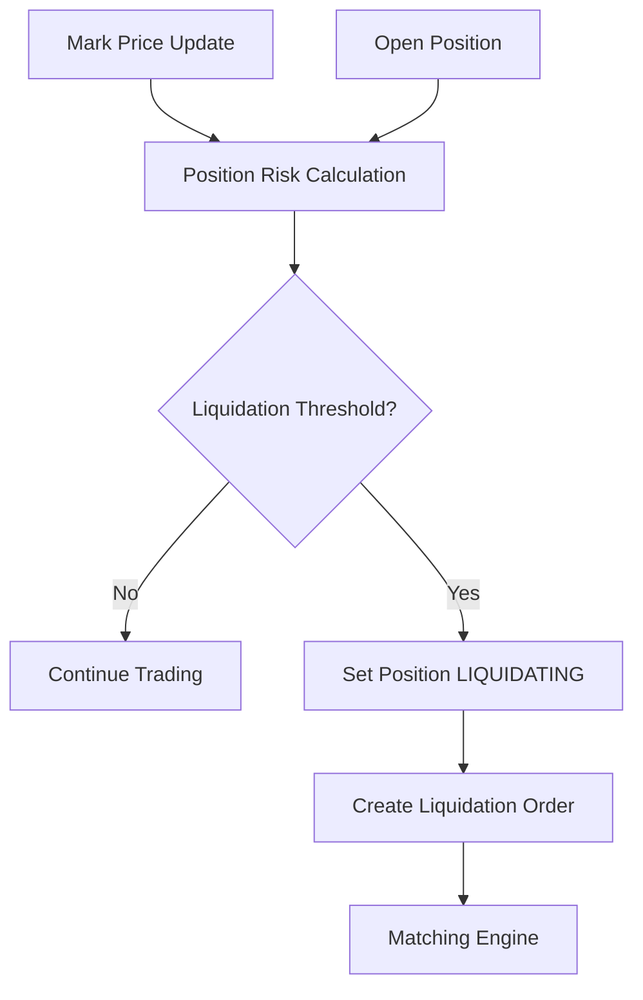
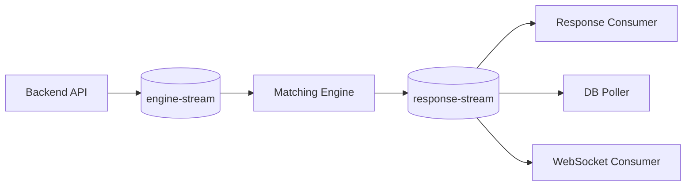
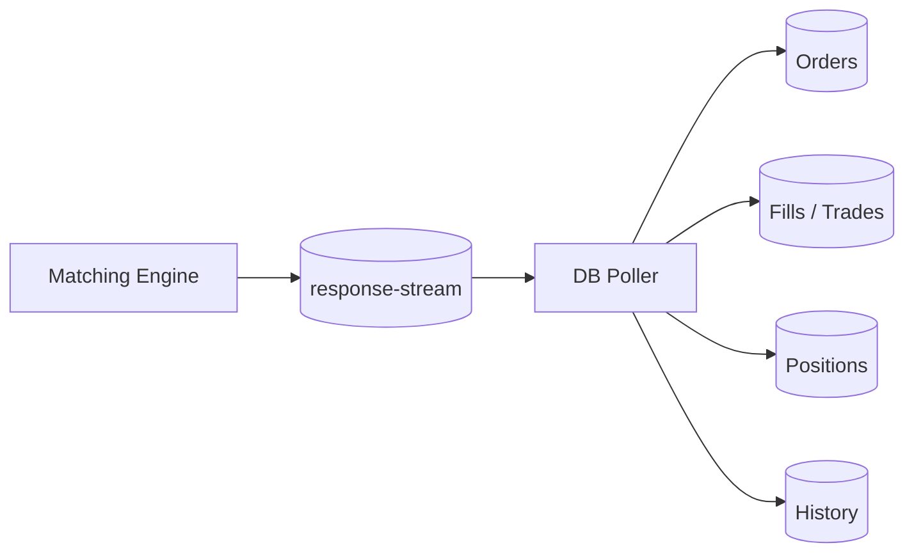
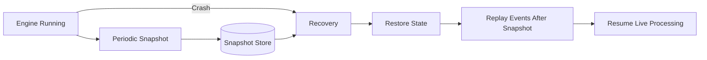

<div align="center">

# PerpX ⚡

### Event-Driven Perpetual Futures Exchange

**A centralized perpetual-futures exchange built around a deterministic matching engine and event-driven architecture.**

</div>

> ⚠️ **Status:** Engineering / educational prototype. Not suitable for real-money trading, custody, or production financial use.

<p align="center">
  <a href="#introduction">Introduction</a> · <a href="#architecture">Architecture</a> · <a href="#order-lifecycle">Order Lifecycle</a> · <a href="#engine-design">Engine Design</a> · <a href="#order-book">Order Book</a> · <a href="#margin--positions">Margin & Positions</a> · <a href="#liquidation">Liquidation</a> · <a href="#event-driven-communication">Event-Driven Communication</a> · <a href="#persistence">Persistence</a> · <a href="#realtime-updates">Realtime Updates</a> · <a href="#snapshots--recovery">Snapshots & Recovery</a> · <a href="#consistency--idempotency">Consistency</a> · <a href="#testing">Testing</a> · <a href="#tech-stack">Tech Stack</a> · <a href="#local-development">Local Development</a>
</p>

---

## Introduction

PerpX explores the engineering problems underneath a centralized perpetual-futures exchange: **deterministic matching, position management, margin, liquidation, asynchronous processing, realtime updates, persistence, and crash recovery.**

> **The matching engine owns authoritative trading state. Services outside the engine communicate with it through commands and events.**

```text
Client → Backend → Command Stream → Matching Engine → Response Stream
                                                    ├──► HTTP Response
                                                    ├──► PostgreSQL
                                                    └──► WebSocket Client
```

---

## Architecture

The system separates the trading client, application/backend layer, authoritative matching engine, persistence, and realtime delivery.

<p align="center">
  
</p>

### System Components

| Component | Responsibility |
|---|---|
| **Next.js Client** | Trading UI, orderbook, orders, positions |
| **Backend API** | Authentication, validation, command creation, request correlation |
| **Redis Command Stream** | Delivers commands to the engine |
| **Matching Engine** | Authoritative trading state and trade execution |
| **Redis Response Stream** | Publishes engine results and state-change events |
| **Response Consumer** | Resolves asynchronous HTTP requests using correlation IDs |
| **DB Poller** | Projects engine events into PostgreSQL |
| **WebSocket Server** | Delivers realtime market and account updates |
| **Mark Price Poller** | Converts external price data into engine updates |
| **Snapshot Store** | Persists engine state for recovery |

---

## Order Lifecycle

An order does not execute inside an HTTP handler. The API validates and publishes a command; the engine processes it independently.



---

## Engine Design

The engine is the core of the exchange. Its state is kept in memory so matching can operate without a database round-trip for every order.



Core responsibilities include order execution, cancellation, partial fills, balances, locked margin, positions, PnL, leverage, funding, liquidation state, event generation, snapshots, and recovery.

---

## Order Book

The order book is organized around **price levels with FIFO ordering inside each level**.

```text
                    ORDER BOOK

        BIDS                    ASKS

     64,900 ─ 3.0            65,100 ─ 2.0
     64,800 ─ 5.0            65,200 ─ 4.0
     64,700 ─ 1.5            65,300 ─ 6.0

                    │
                    ▼
             PRICE-TIME PRIORITY
```

At the same price, the earliest eligible order is matched first. This makes matching deterministic and gives replay/recovery a well-defined ordering model.

---

## Margin & Positions

Perpetual futures extend the spot order book with leveraged positions, collateral, margin, PnL, and risk state.



---

## Liquidation

Liquidation is represented explicitly in engine state rather than being treated as a normal order-flow side effect.



The explicit `LIQUIDATING` state prevents normal trading operations from incorrectly mutating a position while liquidation is active.

---

## Event-Driven Communication

Redis Streams form the communication boundary between the backend and the engine.



One engine event can fan out to multiple downstream consumers without making the engine directly depend on HTTP, PostgreSQL, or WebSocket delivery.

---

## Persistence



PostgreSQL provides the durable, queryable projection while the engine remains the source of truth for live trading state.

---

## Realtime Updates

```text
Engine Event
     │
     ▼
response-stream
     │
     ▼
WebSocket Server
     │
 ┌───┼────┐
 ▼   ▼    ▼
A    B    C
```

Clients bootstrap state through HTTP and receive incremental orderbook, order, trade, and position updates through WebSockets.

---

## Snapshots & Recovery



```text
Latest Snapshot
      │
      ▼
Restore authoritative state
      │
      ▼
Replay events after snapshot
      │
      ▼
Reconstruct current state
      │
      ▼
Resume live processing
```

Snapshots reduce the amount of history that must be replayed after an engine restart.

---

## Consistency & Idempotency

| Component | Model |
|---|---|
| Matching engine | Deterministic state transitions |
| Redis Streams | At-least-once message delivery |
| HTTP response path | Correlation-ID based resolution |
| PostgreSQL | Event-driven projection |
| WebSockets | Realtime event delivery |
| Recovery | Snapshot + stream replay |

Downstream consumers need to tolerate duplicate delivery and replay. The matching engine remains the source of truth.

---

## Testing

The project contains automated tests around core engine behavior and trading state, including matching, partial fills, cancellation, balances, positions, margin, liquidation safeguards, and recovery behavior.

> **Invariant:** The same command sequence should produce the same engine state.

---

## Tech Stack

| Layer | Technology |
|---|---|
| Trading client | Next.js, React, TypeScript |
| Backend | Node.js, TypeScript |
| Engine | TypeScript / Bun |
| Messaging | Redis Streams |
| Persistence | PostgreSQL |
| Realtime | WebSockets |
| Validation | Zod / JSON Schema |
| Testing | Bun test |
| Tooling | Bun, TypeScript |

---

## Project Evolution

```text
Spot Exchange
     │
     ▼
Perpetual Exchange V1
     │
     ▼
PerpX
```

The earlier projects established orderbook/matching concepts and the backend-engine boundary. PerpX pushes the design further into **margin, liquidation, asynchronous event processing, realtime updates, snapshots, recovery, and idempotency**.

---

## Local Development

```bash
git clone https://github.com/MANI-116/Perpetual-futures-CentralizeExchange.git
cd Perpetual-futures-CentralizeExchange
bun install
```

Configure the required PostgreSQL, Redis, authentication, and external market-data environment variables before starting the applications.

---

## Disclaimer

PerpX is an educational engineering project. It is **not** intended for real-money trading, custody, or production financial use.

<div align="center">

### Built to understand what happens underneath a trading platform.

</div>
