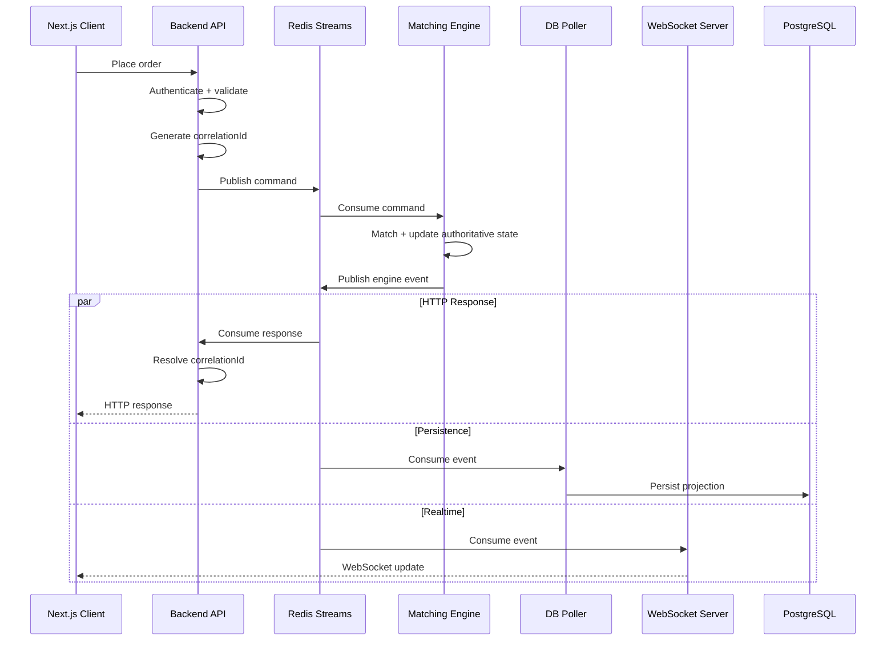
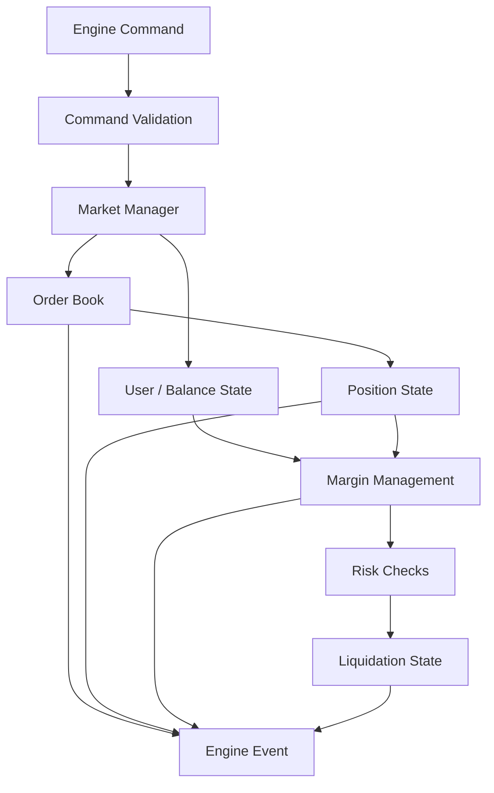
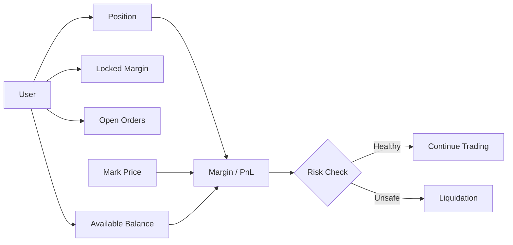
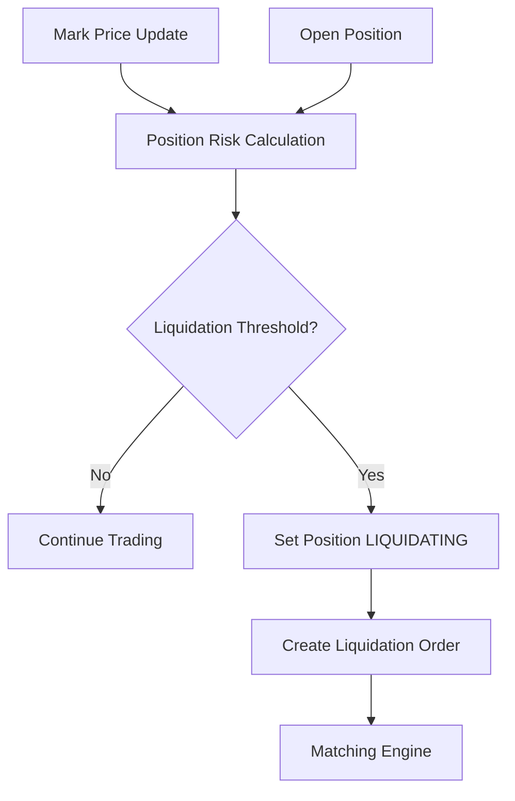
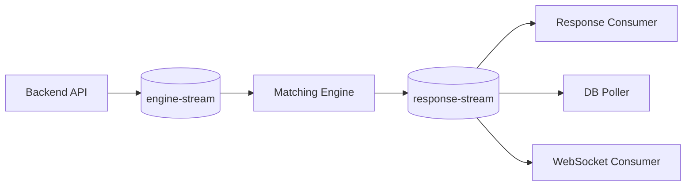
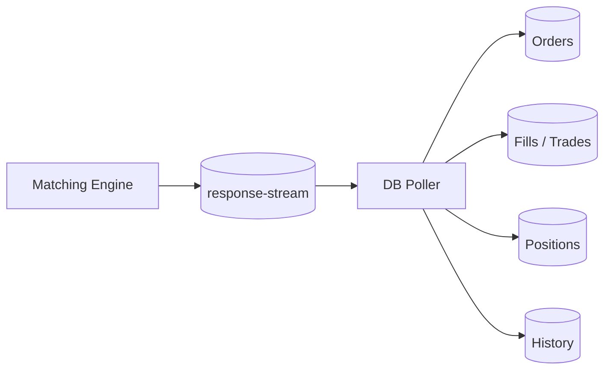
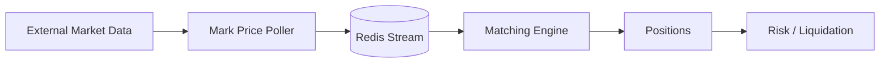
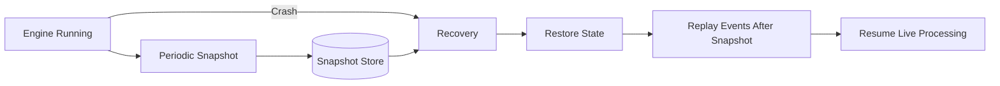

# PerpX ⚡

### Event-Driven Perpetual Futures Exchange

PerpX is a perpetual-futures exchange prototype built around a **deterministic in-memory matching engine**, **Redis Streams**, **PostgreSQL**, **WebSockets**, and a **Next.js trading client**.

The core design principle is simple:

> **The matching engine owns authoritative trading state. Services around it communicate through commands and events.**

**Status:** Development / educational prototype. Not intended for real-money trading or custody.

---

## Navigation

[Architecture](#architecture) · [Order Lifecycle](#order-lifecycle) · [Matching Engine](#matching-engine) · [Event-Driven Communication](#event-driven-communication) · [Trading State](#trading-state) · [Liquidation](#liquidation) · [Persistence](#persistence) · [Snapshots & Recovery](#snapshots--recovery) · [Realtime Updates](#realtime-updates) · [Tech Stack](#tech-stack)

---

## Architecture

PerpX separates the trading engine from HTTP, persistence, and realtime delivery. The backend publishes commands to the engine, while engine events are consumed independently by response handling, persistence, and WebSocket services.


### High-level flow

```text
Client
  │
  │ HTTP / WebSocket
  ▼
Backend API
  │
  │ Command + correlationId
  ▼
Redis Command Stream
  │
  ▼
Matching Engine
  │
  │ Engine Events
  ▼
Redis Response Stream
  ├──────────────► Response Consumer ──► HTTP response
  ├──────────────► DB Poller ──────────► PostgreSQL
  └──────────────► WebSocket Consumer ─► Trading Client
```

This keeps the engine independent from transport and persistence concerns while allowing multiple downstream consumers to react to the same engine event.

---

## Order Lifecycle



The backend does not need to synchronously execute matching inside the HTTP handler. It publishes the command and resolves the eventual response through the correlation ID.

---

## Matching Engine

The matching engine is the authoritative state machine for trading operations.



Core responsibilities include order execution, cancellation, partial fills, balances, locked collateral, positions, PnL, funding, margin checks, liquidation state, event generation, and engine snapshots.

---

## Order Book

The order book is organized around **price levels with FIFO ordering inside each level**.

```text
                    ORDER BOOK

        BIDS                    ASKS

     64,900 ─ 3.0            65,100 ─ 2.0
     64,800 ─ 5.0            65,200 ─ 4.0
     64,700 ─ 1.5            65,300 ─ 6.0

                    │
                    ▼
             PRICE-TIME PRIORITY
```

At the same price, the earliest eligible order is matched first. This makes matching deterministic and gives replay/recovery a well-defined ordering model.

---

## Trading State

Perpetual futures add position and collateral state on top of the order book.



The engine keeps these related state transitions together so an order, fill, position update, and margin transition are not independently invented by downstream services.

---

## Liquidation



The explicit `LIQUIDATING` state prevents normal trading operations from incorrectly mutating a position while liquidation is active.

---

## Event-Driven Communication

Redis Streams form the communication boundary between services.



One engine event can fan out to multiple consumers:

```text
                 response-stream
                       │
          ┌────────────┼────────────┐
          ▼            ▼            ▼
       Backend       DB Poller     WSS
          │            │            │
          ▼            ▼            ▼
       HTTP          Storage      Realtime
```

This keeps matching independent from HTTP, PostgreSQL, and WebSocket delivery.

---

## Persistence

PostgreSQL acts as the durable, queryable persistence/projection layer.



The engine does not need a synchronous database round trip for every matching operation.

---

## Realtime Updates

```text
Engine Event
     │
     ▼
response-stream
     │
     ▼
WebSocket Server
     │
 ┌───┼────┐
 ▼   ▼    ▼
A    B    C
```

Clients can bootstrap state through HTTP and then receive incremental orderbook, order, trade, and position updates through WebSockets.

---

## Mark Price

External market data is kept outside the critical matching path.



---

## Snapshots & Recovery

The engine periodically persists snapshots of its authoritative in-memory state.



Conceptually:

```text
Latest Snapshot
      │
      ▼
Restore authoritative state
      │
      ▼
Replay events after snapshot
      │
      ▼
Reconstruct current state
      │
      ▼
Resume live processing
```

Snapshots reduce the amount of history that must be replayed after an engine restart.

---

## Consistency & Idempotency

| Component | Model |
|---|---|
| Matching engine | Deterministic state transitions |
| Redis Streams | At-least-once message delivery |
| HTTP response path | Correlation-ID based resolution |
| PostgreSQL | Event-driven projection |
| WebSockets | Realtime event delivery |
| Recovery | Snapshot + stream replay |

Downstream consumers therefore need to tolerate duplicate delivery and replay. The matching engine remains the source of truth.

---

## Testing

The project contains automated tests around core engine behavior and trading state, including matching, partial fills, cancellation, balances, positions, margin, liquidation safeguards, and recovery behavior.

The important invariant is that **the same command sequence should produce the same engine state**.

---

## Tech Stack

| Layer | Technology |
|---|---|
| Trading client | Next.js, React, TypeScript |
| Backend | Node.js, TypeScript |
| Engine | TypeScript / Bun |
| Messaging | Redis Streams |
| Persistence | PostgreSQL |
| Realtime | WebSockets |
| Validation | Zod / JSON Schema |
| Testing | Bun test |
| Tooling | Bun, TypeScript |

---

## Project Evolution

PerpX is the later stage of an exchange-engine learning path:

```text
Spot Exchange
     │
     ▼
Perpetual Exchange V1
     │
     ▼
PerpX
```

The earlier projects established orderbook/matching concepts and the backend-engine boundary. PerpX pushes the design further into **margin, liquidation, asynchronous event processing, realtime updates, snapshots, recovery, and idempotency**.

---

## Local Development

```bash
git clone https://github.com/MANI-116/Perpetual-futures-CentralizeExchange.git
cd Perpetual-futures-CentralizeExchange
bun install
```

Configure the required PostgreSQL, Redis, authentication, and external market-data environment variables before starting the applications.

---

## Disclaimer

PerpX is an educational engineering project. It is **not** intended for real-money trading, custody, or production financial use.

### Built to understand what happens underneath a trading platform.
