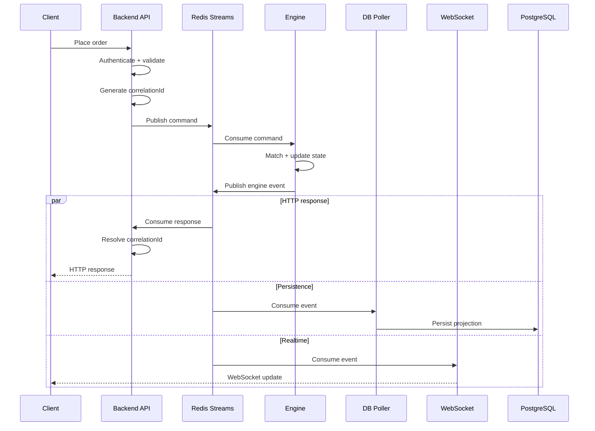
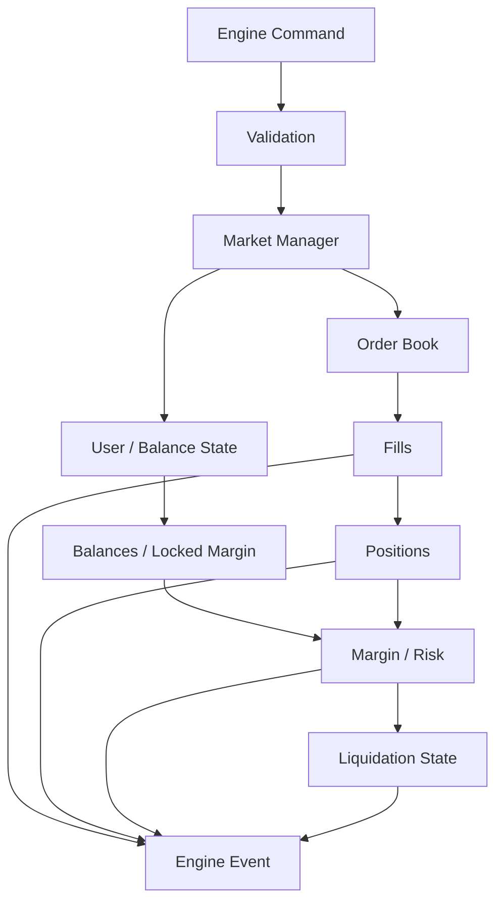
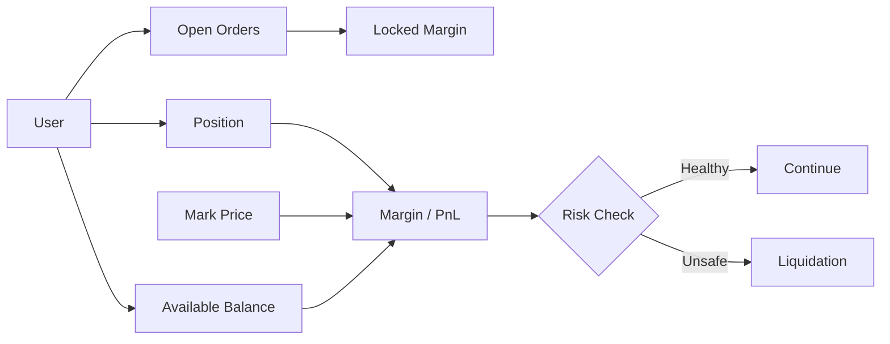
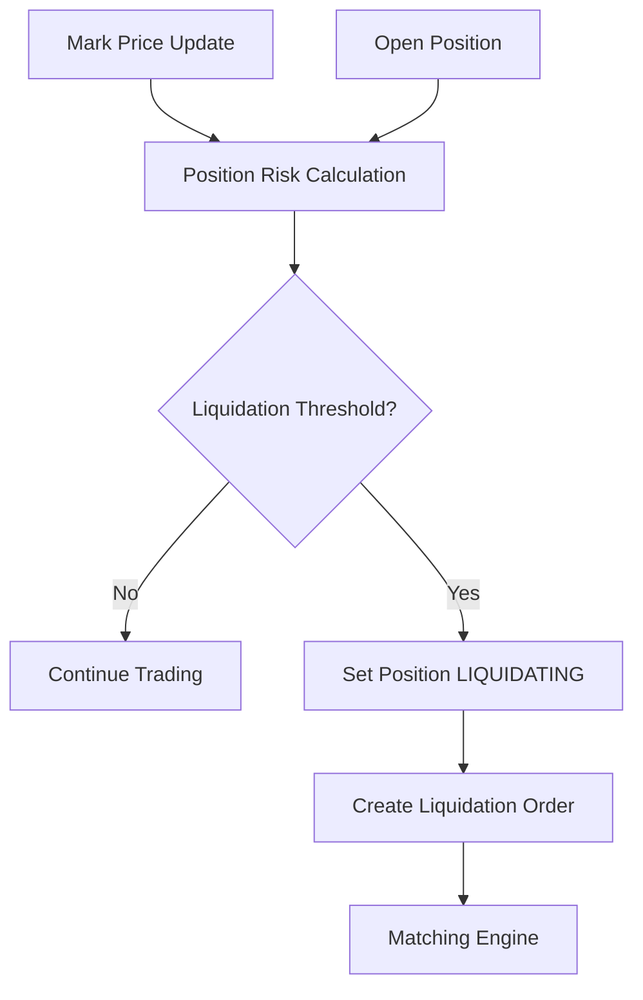
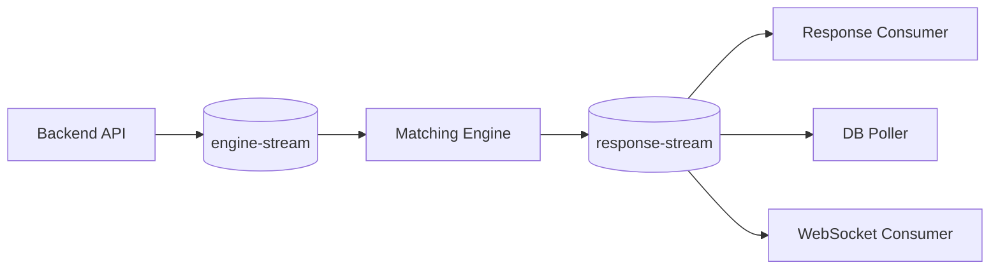
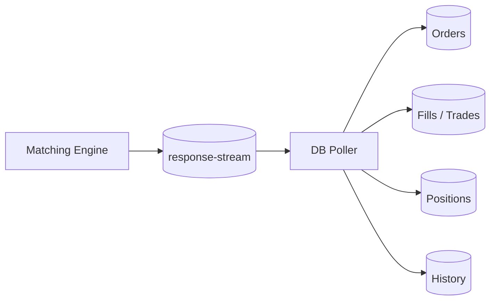
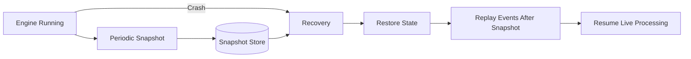

# PerpX ⚡

### Event-Driven Perpetual Futures Exchange

PerpX is a perpetual-futures exchange prototype built around a **deterministic in-memory matching engine**, **Redis Streams**, **PostgreSQL**, **WebSockets**, and a **Next.js trading client**.

> **Client → Backend → Command Stream → Matching Engine → Response Stream → Consumers → Client / Persistence**

> ⚠️ **Status:** Engineering / educational prototype. Not suitable for real-money trading, custody, or production financial use.

**Introduction · Architecture · Order Lifecycle · Engine Design · Order Book · Margin & Positions · Liquidation · Event-Driven Communication · Persistence · Realtime Updates · Snapshots & Recovery · Consistency · Testing · Tech Stack · Local Development**

---

## Introduction

The central design decision is simple:

> **The matching engine owns authoritative trading state. Services outside the engine communicate with it through commands and events.**

PerpX explores the engineering problems underneath a centralized perpetual-futures exchange: deterministic matching, position management, margin, liquidation, asynchronous processing, realtime updates, persistence, and crash recovery.

---

## Architecture


### System flow

```text
Client
  │
  │ HTTP / WebSocket
  ▼
Backend API
  │
  │ Command + correlationId
  ▼
Redis Command Stream
  │
  ▼
Matching Engine
  │
  │ Engine Events
  ▼
Redis Response Stream
  ├──────────────► Response Consumer ──► HTTP response
  ├──────────────► DB Poller ──────────► PostgreSQL
  └──────────────► WebSocket Consumer ─► Trading Client
```

| Component | Responsibility |
|---|---|
| **Next.js client** | Trading UI, orderbook, orders, positions |
| **Backend API** | Authentication, validation, command creation, request correlation |
| **Command stream** | Delivers commands to the engine |
| **Matching engine** | Owns authoritative trading state and executes trades |
| **Response/event stream** | Publishes engine results and state-change events |
| **Response consumer** | Resolves asynchronous HTTP requests using correlation IDs |
| **DB poller** | Projects engine events into PostgreSQL |
| **WebSocket server** | Delivers realtime market updates |
| **Mark-price poller** | Converts external prices into engine updates |
| **Snapshot store** | Persists engine state for recovery |

---

## Order Lifecycle

An order does not execute inside an HTTP handler. The API validates and publishes a command; the engine processes it independently.



---

## Engine Design

The engine is the core of the exchange. Its state is kept in memory so matching can operate without a database round-trip for every order.



Core responsibilities include order execution, cancellation, partial fills, balances, locked margin, positions, PnL, leverage, funding, liquidation state, event generation, snapshots, and recovery.

---

## Order Book

The order book is organized around **price levels with FIFO ordering inside each level**.

```text
                    ORDER BOOK

        BIDS                    ASKS

     64,900 ─ 3.0            65,100 ─ 2.0
     64,800 ─ 5.0            65,200 ─ 4.0
     64,700 ─ 1.5            65,300 ─ 6.0

                    │
                    ▼
             PRICE-TIME PRIORITY
```

At the same price, the earliest eligible order is matched first. This makes matching deterministic and gives replay/recovery a well-defined ordering model.

---

## Margin & Positions



Perpetual futures extend the spot order book with leveraged positions, collateral, margin, PnL, and risk state.

---

## Liquidation



The explicit `LIQUIDATING` state prevents normal trading operations from incorrectly mutating a position while liquidation is active.

---

## Event-Driven Communication



One engine event can fan out to multiple downstream consumers without making the engine directly depend on HTTP, PostgreSQL, or WebSocket delivery.

---

## Persistence



PostgreSQL provides the durable, queryable projection while the engine remains the source of truth for live trading state.

---

## Realtime Updates

```text
Engine Event
     │
     ▼
response-stream
     │
     ▼
WebSocket Server
     │
 ┌───┼────┐
 ▼   ▼    ▼
A    B    C
```

Clients bootstrap state through HTTP and receive incremental orderbook, order, trade, and position updates through WebSockets.

---

## Snapshots & Recovery



```text
Latest Snapshot
      │
      ▼
Restore authoritative state
      │
      ▼
Replay events after snapshot
      │
      ▼
Reconstruct current state
      │
      ▼
Resume live processing
```

Snapshots reduce the amount of history that must be replayed after an engine restart.

---

## Consistency & Idempotency

| Component | Model |
|---|---|
| Matching engine | Deterministic state transitions |
| Redis Streams | At-least-once message delivery |
| HTTP response path | Correlation-ID based resolution |
| PostgreSQL | Event-driven projection |
| WebSockets | Realtime event delivery |
| Recovery | Snapshot + stream replay |

Downstream consumers need to tolerate duplicate delivery and replay. The matching engine remains the source of truth.

---

## Testing

The project contains automated tests around core engine behavior and trading state, including matching, partial fills, cancellation, balances, positions, margin, liquidation safeguards, and recovery behavior.

> **Invariant:** The same command sequence should produce the same engine state.

---

## Tech Stack

| Layer | Technology |
|---|---|
| Trading client | Next.js, React, TypeScript |
| Backend | Node.js, TypeScript |
| Engine | TypeScript / Bun |
| Messaging | Redis Streams |
| Persistence | PostgreSQL |
| Realtime | WebSockets |
| Validation | Zod / JSON Schema |
| Testing | Bun test |
| Tooling | Bun, TypeScript |

---

## Project Evolution

```text
Spot Exchange
     │
     ▼
Perpetual Exchange V1
     │
     ▼
PerpX
```

The earlier projects established orderbook/matching concepts and the backend-engine boundary. PerpX pushes the design further into **margin, liquidation, asynchronous event processing, realtime updates, snapshots, recovery, and idempotency**.

---

## Local Development

```bash
git clone https://github.com/MANI-116/Perpetual-futures-CentralizeExchange.git
cd Perpetual-futures-CentralizeExchange
bun install
```

Configure the required PostgreSQL, Redis, authentication, and external market-data environment variables before starting the applications.

---

## Disclaimer

PerpX is an educational engineering project. It is **not** intended for real-money trading, custody, or production financial use.

### Built to understand what happens underneath a trading platform.
