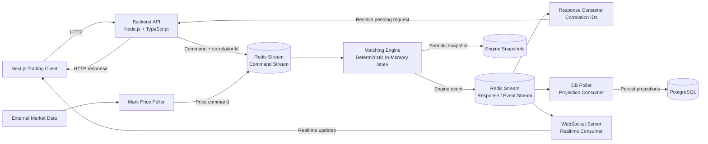
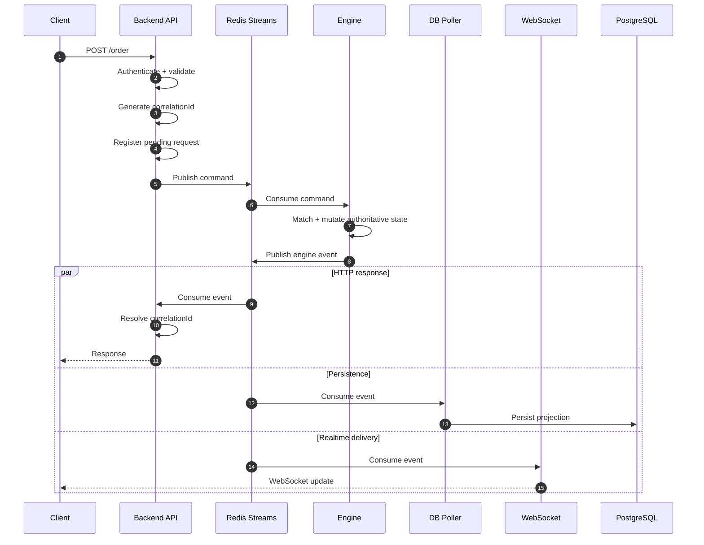
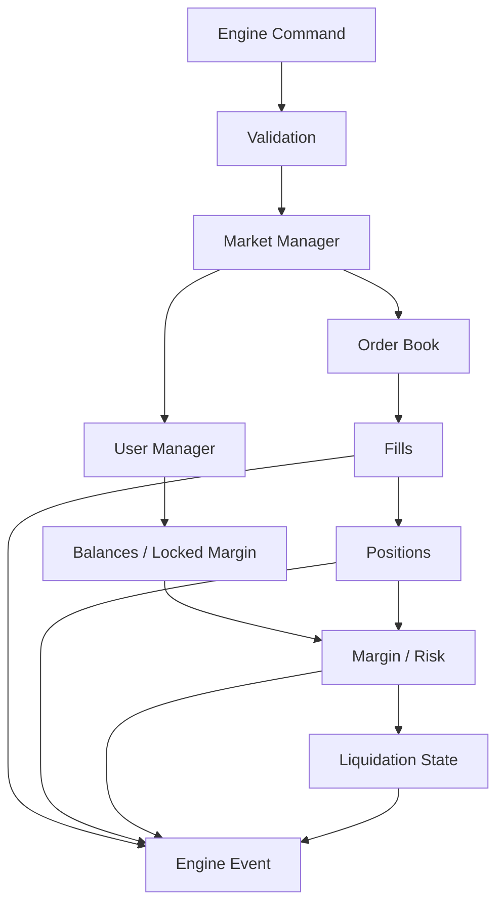
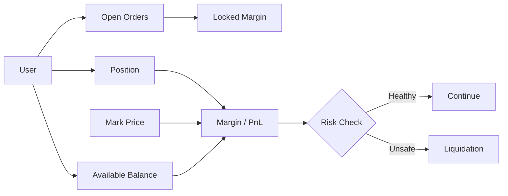
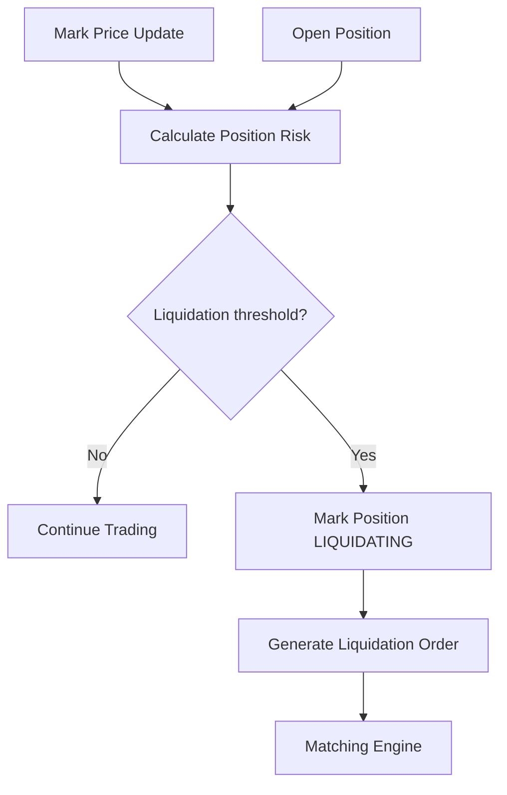
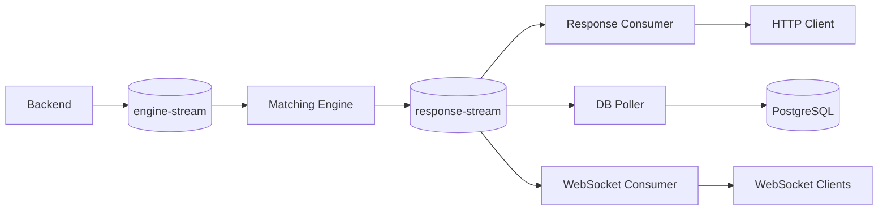
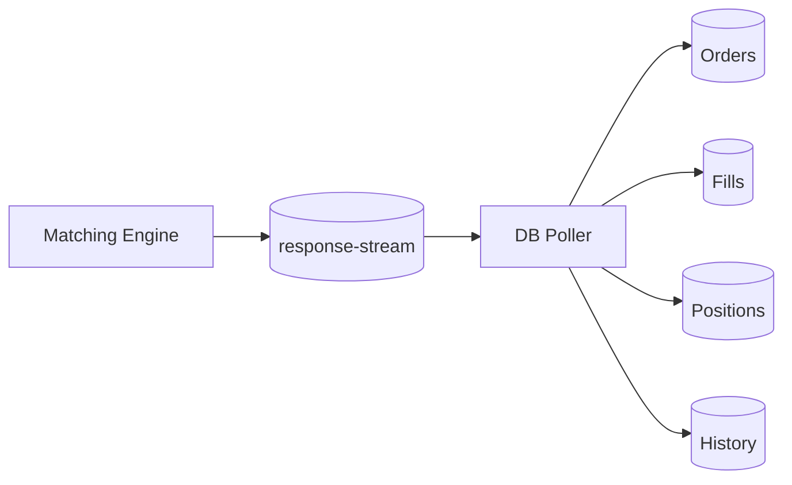
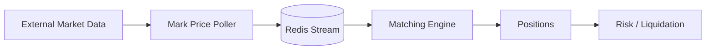
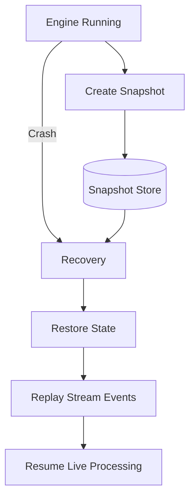

# PerpX ⚡

### Event-Driven Perpetual Futures Exchange

PerpX is a **perpetual futures exchange prototype** built around a deterministic in-memory matching engine and an event-driven backend architecture.

It combines **TypeScript, Node.js, Redis Streams, PostgreSQL, WebSockets, and Next.js** to model the complete trading lifecycle:

> **Client → Command → Matching → Engine Event → HTTP Response + Persistence + Realtime Update**

The project focuses on the hard engineering problems behind exchange infrastructure: **authoritative state, deterministic matching, asynchronous processing, margin, liquidation, event propagation, idempotency, snapshots, and crash recovery.**

> ⚠️ **Status:** Engineering / educational prototype. Not suitable for real-money trading, custody, or production financial use.

---

## Contents

- [Architecture](#architecture)
- [Order Lifecycle](#order-lifecycle)
- [Engine Design](#engine-design)
- [Order Book](#order-book)
- [Margin and Positions](#margin-and-positions)
- [Liquidation](#liquidation)
- [Event-Driven Communication](#event-driven-communication)
- [Persistence](#persistence)
- [Realtime Updates](#realtime-updates)
- [Snapshots and Recovery](#snapshots-and-recovery)
- [Consistency and Idempotency](#consistency-and-idempotency)
- [Testing](#testing)
- [Tech Stack](#tech-stack)
- [Project Structure](#project-structure)
- [Local Development](#local-development)

---

# Architecture

The central design decision is simple:

> **The matching engine owns authoritative trading state. Services outside the engine communicate with it through commands and events.**



### Separation of responsibilities

| Component | Responsibility |
|---|---|
| **Next.js client** | Trading UI, orderbook, orders, positions |
| **Backend API** | Auth, validation, command creation, request correlation |
| **Command stream** | Delivers commands to the engine |
| **Matching engine** | Owns authoritative trading state and executes trades |
| **Response/event stream** | Publishes engine results and state-change events |
| **Response consumer** | Resolves asynchronous HTTP requests using correlation IDs |
| **DB poller** | Projects engine events into PostgreSQL |
| **WebSocket server** | Delivers realtime market updates |
| **Mark-price poller** | Converts external prices into engine updates |
| **Snapshot store** | Persists engine state for recovery |

---

# Order Lifecycle

An order does not execute inside an HTTP handler. The API validates and publishes a command; the engine processes it independently.



This lets Node.js continue processing other requests while the engine handles the command instead of blocking the event loop around engine execution.

---

# Engine Design

The engine is the core of the exchange. Its state is kept in memory so matching can operate without a database round-trip for every order.



The engine is responsible for state transitions such as:

- limit and market order execution
- order cancellation
- partial fills
- price-time priority
- balance and locked-margin updates
- position creation and reduction
- realized PnL
- leverage and margin checks
- funding state
- liquidation state
- event generation
- snapshots and state restoration

---

# Order Book

The order book is organized around **price levels with FIFO ordering inside each level**.

```text
                    ORDER BOOK

       BIDS                         ASKS

   64,900 ─── 3.0              65,100 ─── 2.0
   64,800 ─── 5.0              65,200 ─── 4.0
   64,700 ─── 1.5              65,300 ─── 6.0

                    │
                    ▼
              PRICE-TIME PRIORITY
```

At an individual price level:

```text
Price = 65,000

┌──────────────┐
│ Order A      │  ← oldest / first eligible
├──────────────┤
│ Order B      │
├──────────────┤
│ Order C      │
└──────────────┘
```

This makes matching deterministic and provides a clear ordering model for replay and recovery.

---

# Margin and Positions

PerpX extends a conventional spot order book with leveraged position state.



The important distinction is that **order margin and position margin affect the same authoritative engine state**; they cannot safely be treated as independent database records during matching.

---

# Liquidation

Liquidation is represented explicitly in engine state rather than being treated as a normal order-flow side effect.



The explicit `LIQUIDATING` state prevents normal order operations from incorrectly modifying a position while liquidation is in progress.

---

# Event-Driven Communication

Redis Streams are the boundary between the backend and the engine.



One engine event can therefore feed multiple downstream consumers without making the engine directly depend on HTTP, PostgreSQL, or WebSocket infrastructure.

### Why this matters

The engine produces **facts about state transitions**. Downstream services decide what they need to do with those facts.

```text
                 response-stream
                       │
          ┌────────────┼────────────┐
          ▼            ▼            ▼
       Backend       DB Poller     WSS
          │            │            │
          ▼            ▼            ▼
       HTTP          Storage      Realtime
```

---

# Persistence

PostgreSQL is used as the durable persistence/projection layer rather than being synchronously queried for every matching operation.



This separation allows the engine to optimize for deterministic state transitions while PostgreSQL provides durable, queryable data for application features.

---

# Realtime Updates

The WebSocket layer consumes events independently from the engine.

```text
Engine Event
     │
     ▼
response-stream
     │
     ▼
WebSocket Server
     │
 ┌───┼────┐
 ▼   ▼    ▼
A    B    C
```

Clients can bootstrap state through HTTP and then receive incremental updates through WebSockets.

For orderbook updates, sequence identifiers provide a way to detect gaps and trigger resynchronization when a client misses events.

---

# Mark Price

External market data is kept outside the matching loop.



The engine receives price information as commands/events rather than maintaining an external network connection inside the critical matching path.

---

# Snapshots and Recovery

The engine periodically persists snapshots of its authoritative in-memory state.



Conceptually:

```text
Latest Snapshot
      │
      ▼
Restore authoritative state
      │
      ▼
Replay events after snapshot
      │
      ▼
Reconstruct current state
      │
      ▼
Resume live processing
```

Snapshots allow the engine to avoid rebuilding its entire state from the beginning of the event history after a crash.

---

# Consistency and Idempotency

Different parts of the system intentionally have different consistency characteristics.

| Component | Model |
|---|---|
| Matching engine | Deterministic state transitions |
| Redis Streams | At-least-once message delivery |
| HTTP response path | Correlation-ID based resolution |
| PostgreSQL | Eventually consistent projection of engine events |
| WebSockets | Realtime event delivery |
| Recovery | Snapshot + stream replay |

This means downstream consumers must be designed with duplicate delivery and replay in mind. The engine's state transitions remain the source of truth; projections and realtime consumers should not independently invent trading state.

---

# Testing

The exchange contains automated tests around core engine behavior and trading state.

Important test areas include:

- order matching
- partial fills
- order cancellation
- balance updates
- position transitions
- margin behavior
- liquidation safeguards
- snapshot/recovery behavior
- event processing

The goal is not simply endpoint coverage; the critical invariant is that **the same command sequence produces the same engine state**.

---

# Tech Stack

| Layer | Technology |
|---|---|
| Frontend | Next.js, React, TypeScript |
| Backend | Node.js, TypeScript |
| Engine | TypeScript, in-memory state |
| Messaging | Redis Streams |
| Persistence | PostgreSQL |
| Realtime | WebSockets |
| Validation | Zod / schema validation |
| Testing | Bun test |
| Runtime / tooling | Bun, TypeScript |

---

# Project Structure

```text
PerpX
├── apps/
│   ├── backend/        # HTTP API and application services
│   ├── engine/         # Authoritative matching engine
│   └── frontend/       # Next.js trading client
│
├── packages/
│   ├── engine-package/ # Engine domain logic
│   ├── types/           # Shared contracts/types
│   └── ...
│
└── README.md
```

The exact package layout may evolve as the system develops; the architectural boundary is the important part: **client/application services are separated from the exchange engine.**

---

# Engineering Decisions

### Why keep matching state in memory?

Matching requires ordered, low-latency state transitions. Putting the critical matching path behind a database would introduce unnecessary network and serialization overhead.

### Why Redis Streams?

Streams provide a durable asynchronous boundary between producers and consumers while allowing the engine, persistence layer, and realtime layer to evolve independently.

### Why separate persistence from matching?

The database is excellent for durable queries and historical data, but it should not become the synchronization mechanism for every engine state transition.

### Why snapshots?

A large in-memory engine state should not require replaying the entire lifetime of the exchange after every restart. Snapshots reduce recovery work to a bounded replay window.

---

# Local Development

### Prerequisites

- Node.js / Bun
- Redis
- PostgreSQL

### Install

```bash
bun install
```

### Environment

Configure the required database, Redis, authentication, and external market-data environment variables used by the applications.

### Run

Start the required services according to the scripts in the individual applications/packages.

For development, the typical architecture is:

```text
Frontend
   │
Backend
   │
Redis
   │
Engine
   │
PostgreSQL
```

---

# Project Evolution

PerpX is the mature stage of an exchange-engine learning path:

```text
Spot Exchange
     │
     ▼
Perpetual Exchange V1
     │
     ▼
PerpX
```

The earlier projects established orderbook/matching concepts and the backend-engine boundary. PerpX pushes the design further into **margin, liquidation, asynchronous event processing, snapshots, recovery, idempotency, and production-oriented failure handling**.

---

# Disclaimer

PerpX is an educational engineering project. It is **not** an exchange for real-money trading and provides no guarantee of financial correctness, security, custody, or production readiness.

---

### Built to understand what happens underneath a trading platform.
